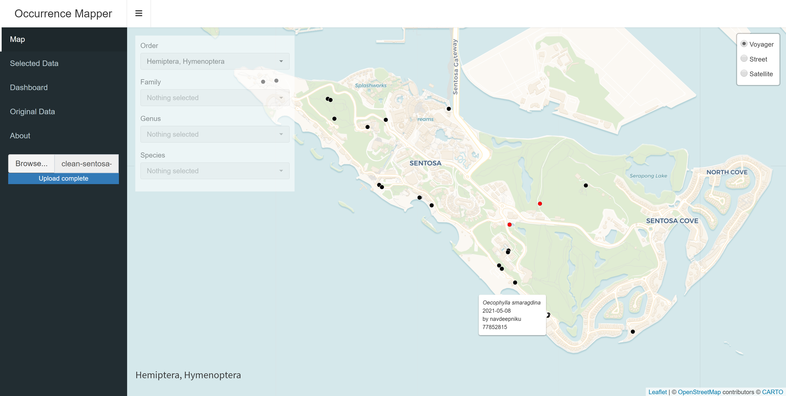

# Occurrence Mapper

This Shiny dashboard app accepts your occurrence data and returns its table view, statistical summaries and an interactive map. The pickers in the sidebar let you filter the occurrences displayed on the map, based on their scientific name, genus, family or order. You can select points on the map and view your selection in a table, as well as download it. This repository works with open-sourced datasets only.

A screenshot of the expected user interface upon loading a dataset is as follows:



## Project Structure

The app's project structure is as follows:

```
occurrence-mapper
│   app.R
│   occurrence-mapper.Rproj
│   README.md
│   styles.css
│
└───data
        clean-sentosa-observations-155147-formatted.csv
        template-dataset.csv
```

It comprises three major components. `app.R` contains code for the frontend (what components are available on the app) as well as the backend (data processing, interactivity). `styles.css` is a CSS file for additional control over the frontend's design. 

The subfolder `data` contains two items:
1. template-dataset.csv - a demo dataset you can load into the app
2. clean-sentosa-observations-155147-formatted.csv - a formatted Sentosa insect occurrence dataset from iNaturalist

## How To Use

If running locally, open the .Rproj file in RStudio, navigate to `app.R` and click "Run App" on the top right hand corner. Alternatively, here's a [demo](https://tzemin.shinyapps.io/occurrence-mapper).

To upload your occurrence data, your file must be in .csv and requires the following column headers (case sensitive) in no particular sequence. NAs are allowed in the data. Additional columns in your data can be left alone; they will be displayed as well. You can open up `template-dataset.csv` to see an example of a viable dataset.

| Column Name | Description |
|---|---|
| id | Unique identifier of record |
| sciname | Scientific name of observation |
| genus | Genus of observation |
| family | Family of observation |
| order | Order of observation |
| date | Date of collection or record |
| recorder | Name(s) of the persons who recorded the observation |
| longitude | Longitude of record |
| latitude | Latitude of record |

## References

- The inspiration for this app was Edward Parker's [COVID-19 Tracker](https://shiny.rstudio.com/gallery/covid19-tracker.html), whose code is available as a [GitHub repository](https://github.com/eparker12/nCoV_tracker).
- RStudio's official guide to shinydashboard - especially their [Getting Started](http://rstudio.github.io/shinydashboard/get_started.html) and [Structure](http://rstudio.github.io/shinydashboard/structure.html) pages - helps you understand how `app.R` is structured.
